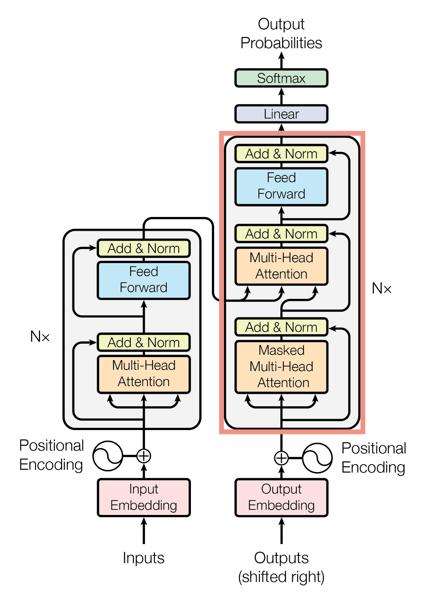
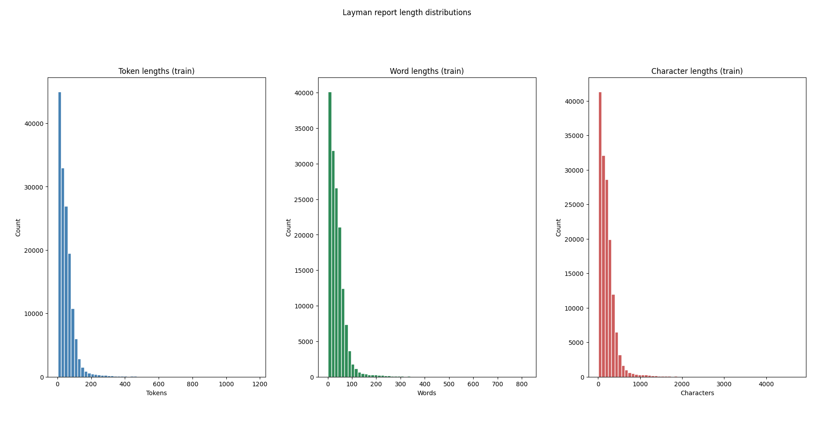
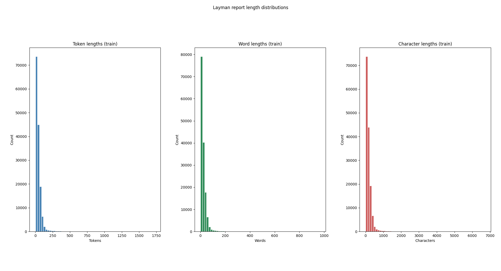
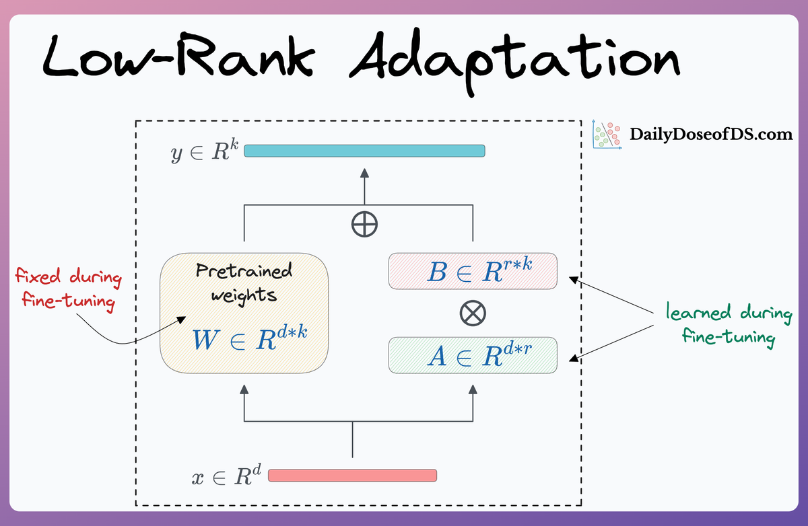

# Generating Layperson Summaries of Expert Radiology Reports through Fine-tuning an existing LLM

## Table of Contents

1. [Overview](#overview)
2. [Model Choice](#model-choice)
3. [What is Fine Tuning?](#what-is-fine-tuning)
4. [Dataset](#dataset)
5. [Data Augmentation](#data-augmentation)
6. [Training Setup](#training-setup)
7. [Full parameter training results](#full-parameter-training-results)
    - [Hyperparameters](#hyperparameters)
    - [Sample predictions](#sample-predictions)
    - [Analysis](#analysis)
    - [Optimizations Made](#optimizations-made)
8. [LoRA Training results](#lora-training-results)
    - [What is LoRA](#what-is-lora)
    - [How to use LoRA](#how-to-use-lora)
    - [Results](#results)
    - [Hyperparameters](#hyperparameters-1)
    - [Sample predictions](#sample-predictions-1)
    - [Analysis](#analysis-1)
    - [Optimizations Made](#optimizations-made-1)
9. [File Structure](#file-structure)
10. [Installation](#installation)
    - [Requirements](#requirements)
    - [Setup](#setup)
12. [Usage](#usage)
    - [Training](#training)
    - [Predictions](#predictions)
13. [Future Improvements](#future-improvements)
14. [References](#references)

## Overview

**Problem:**\
After getting imaging done, patients often want to know their results immediately and directly, rather than going to a GP or specialist who will brief them on their radiology report. Patients have access to their radiology reports, but often need help understanding them. Radiology reports contain complex medical terminology and jargon that can be difficult for patients to interpret. In addition, tools like chatGPT are not all together trust-worthy enough to translate radiology reports into layperson-friendly summaries.\
This project aims to address these issues by fine-tuning an open-source encoder-decoder language model with radiology report inputs and lay summary outputs from the [BioLaySumm2025](https://huggingface.co/datasets/BioLaySumm/BioLaySumm2025-LaymanRRG-opensource-track) dataset -- increasing its accuracy and reliability.

**Finetuning Model:**\
`google/flan-t5-base` (encoder–decoder) was chosen to finetune -- this choice is discussed in detail in the [Model Choice](#model-choice) section. The model is trained with a custom PyTorch trainer module (`Train`) and evaluated using [ROUGE](https://huggingface.co/spaces/evaluate-metric/rouge).

## Model Choice

The model used is `google/flan-t5-base`, an encoder–decoder Transformer instruction-tuned on a wide range of tasks, importantly including summarization. The base model offers a strong quality/compute trade-off and is small enough for consumer GPUs while remaining expressive for domain adaptation. FLAN-T5 is particularly effective for tasks like **radiology-to-layperson summarization** because it was trained on instruction-following data, making it highly capable in handling **contextual instructions**.

| Attribute                     | **FLAN-T5 Base**    |
| ----------------------------- | ------------------- |
| **Total Parameters**          | 247,577,856         |
| **LoRA Trainable Fraction**   | 1.41% (3,538,944)   |

The encoder-decoder model architecture was chosen over decoder-only models because it allows for better control over the generation process and a more effective fine-tuning process.

## What is Fine Tuning?

Transformer models are a type of neural network architecture that has been shown to be highly effective for natural language processing tasks. They are particularly well-suited for tasks such as language translation, text summarization, and question answering.

Transformer models are composed of an encoder and a decoder, which work together to process input data and generate output data. The encoder takes the input data and transforms it into a fixed-length representation, while the decoder takes this representation and generates the output data. A key feature of the transformer architecture is self-attention, which is what allows the model to essentially give context to each token through an attention layer. The general transformer architecture is shown below:


<p align="center">
  <em>Figure 1: Transformer Model Architecture (Vaswani et al., 2024)</em>
</p>

This same architecture is used in google's T5 model.\
To fine tune the model, it is trained on our dataset using cross-entropy loss, AdamW optimizer, and a cosine learning rate scheduler with a custom PyTorch trainer module.

## Dataset

The [dataset](https://huggingface.co/datasets/BioLaySumm/BioLaySumm2025-LaymanRRG-opensource-track) provided on Hugging face contains 4 columns:

| Column Name       | Data type | Example Data              | Description             |
| ----------------- | --------- | ------------------------- | ------------------------|
| source            | string    | `PadChest`                | The source of the data  |
| images_path       | string    | `21684..._02-012-057.png` | Associated image path   |
| radiology_report  | string    | `Within normal limits.`   | Expert report           |
| layman_report     | string    | `Everything looks normal.`| Layman report           |

The overall dataset is already split into a training split of training data, validating data and testing data. This is from a total of $`\approx 171K`$ rows:

$` 150,454\ (Train) + 10,000\ (Validate) + 10,537\ (Test) = 170,991 `$

## Data Augmentation

For the purposes of this fine tuning, only the `radiology_report` and `layman_report` features were required (the `source` and `images_path` columns are dropped during cleaning).
Therefore the dataset was filtered to only include these two features.

> The `source` column contains the extra danger of data leakage. It is not used in the fine tuning process.

In addition, because some rows rely on images as context, i.e about ~423 entries contain trivial radiology text such as "interpretation". These are filtered out during cleaning by the helpers in `utils.py` (see `_clean_split` and `clean_and_overwrite_local_cache`) before tokenization.

Finally, to optimize the training, the length of the layman report and radiology reports also need to be considered. In `utils.py` the `plot_layman_length_histogram` function was created to visualize the distribution of layman report lengths and output the percentile lengths. As can be seen from the table below, the length of the 95th percentile layman report in tokens is significantly lower than the max tokens. As such the 95th percentile length is used as the max length for the layman report, and similarly the 95th percentile radiology report length is used as the max length for the radiology report.

**Histogram Findings -- Layman Report**:

| Metric | Count | Min | P50 | P75 | P90 | P95 | P99 | Max |
|--------|------:|----:|----:|----:|----:|----:|----:|----:|
| Tokens | 150048 | 2 | 40.0 | 67.0 | 99.0 | 127.0 | 290.0 | 1175 |
| Words  | 150048 | 1 | 30.0 | 50.0 | 73.0 | 94.0  | 208.0 | 817  |
| Chars  | 150048 | 7 | 167.0| 280.0| 408.0| 522.0 | 1163.5299999999988 | 4709 |

<p align="center">
    
    <br/>
    <em>Figure 2: Layman Report Length Distribution</em>
</p>

**Histogram Findings -- Radiology Report**:

| Metric | Count | Min | P50 | P75 | P90 | P95 | P99 | Max |
|--------|------:|----:|----:|----:|----:|----:|----:|----:|
| Tokens | 150048 | 1 | 30.0 | 53.0 | 81.0 | 106.0 | 284.0 | 1725 |
| Words  | 150048 | 1 | 16.0 | 30.0 | 46.0 | 61.0  | 154.0 | 964  |
| Chars  | 150048 | 5 | 119.0| 211.0| 322.0| 419.0 | 1078.0 | 6706 |

<p align="center">
    
    <br/>
    <em>Figure 3: Radiology Report Length Distribution</em>
</p>

Based off this, the model truncates input tokens to a maximum of 128.

## Training Setup:
The model is trained with a custom PyTorch trainer module (`Train`) using **ROUGE** as the evaluation metric.

**Hardware Used:**:\
**GPU:** NVIDIA A100 PCIe (80GB VRAM)
**Memory:** 117GB available RAM

**What are ROUGE metrics?**:\
ROUGE (Recall-Oriented Understudy for Gisting Evaluation) is a set of metrics used to evaluate the quality of text summarization. It measures the overlap between the generated summary and the reference summary, considering different n-gram sizes (unigrams, bigrams, trigrams, etc.). ROUGE-N measures n-gram overlap, ROUGE-L measures longest common subsequence overlap, and ROUGE-S measures skip-bigram overlap. ROUGE-LSum measures skip-trigram overlap.

> For the first full parameter tuning, ROUGE-L was used to determine the best model. For the second LoRA tuning, ROUGE-LSum was used to determine the best model.

**Custom PyTorch Trainer (`Train`)**:\
A manual training loop was implemented in PyTorch that supports full fine-tuning and LoRA adapters, AdamW optimizer, cosine learning rate scheduling with warmup, gradient accumulation, mixed precision (fp16/bf16), per-epoch validation, and automatic saving of best/last checkpoints and training plots (loss/LR).

<!--- Architecture: T5-style Transformer. The encoder reads the input radiology report; the decoder generates the lay summary. Decoder cross-attends to encoder states to condition generation on the source text.
- Objective: Cross-entropy over decoder tokens (label padding set to -100 so padding is ignored in the loss).
- Data preprocessing:
  - Instruction prefix: Each input is prepended with
    "Summarize the following radiology report for a layperson:"
    This matches `DataConfig.instruction_prefix` in `dataset.py` to steer the model explicitly toward layperson summarization.
  - Sequence lengths: `max_source_len=128`, `max_target_len=128`, chosen based on the dataset length histograms (roughly around the 95th percentile).
- Tokenization: Uses the pretrained SentencePiece tokenizer that ships with the checkpoint.
- Training setup: Hugging Face `Seq2SeqTrainer` with `predict_with_generate=True` and ROUGE metrics (`rouge1`, `rouge2`, `rougeL`, `rougeLsum`). The best checkpoint is selected by `rougeLsum`.-->

## Full parameter training results
For the first run of training, the model was trained without optimizations such as LoRA, gradient accumulation and input text prepending. The model was also evaluated on ROUGE-L rather than ROUGE-Lsum. The training results are shown below:

| Metric                                | Value                                |
|--------------------------------------:|-------------------------------------:|
| ROUGE-1 (final epoch)                 | 0.561618     (56.16%)                |
| ROUGE-2 (final epoch)                 | 0.442797     (44.28%)                |
| ROUGE-L (final epoch)                 | 0.533015     (53.30%)                |
| Total training time                   | 11012.296 seconds (≈ 3:03:30)        |
| Total epochs                          | 3.0                                  |

### Hyperparameters

| Hyperparameter                        | Value                                |
|--------------------------------------:|-------------------------------------:|
| Learning rate                         | 2e-4                                 |
| Batch size                            | 8                                    |
| Gradient accumulation steps           | 1                                    |
| Epochs                                | 3                                    |
| Input text prepending                 | False                                |

### Sample predictions:

---

#### **CASE 1**
**SOURCE**:\
Right parahilar infiltrate and atelectasis. Increased retrocardiac density related to atelectasis and consolidation associated with right pleural effusion. Clinical data is important for correct radiological assessment.

**BASE MODEL (with prompt)**:\
Clinical data are important for correct radiological assessment of right parahilar infiltrate and atelectasis.

**SUMMARY**:\
There is an area of lung inflammation and partially collapsed lung on the right side near the bronchus. There is also an increased density behind the heart, which could be due to the collapsed lung and lung tissue thickening, along with fluid buildup around the lung on the right side. It is important to have clinical data to accurately assess the radiological findings.

**SUMMARY -- FROM DATA**:\
There is a cloudiness near the right lung's airways and a part of the lung has collapsed. The area behind the heart is denser, which could be due to the collapsed lung and a possible lung infection along with fluid around the right lung. It's important to consider the patient's medical history for a proper understanding of the x-ray.

---

#### **CASE 2**
**SOURCE**:\
Calcified granuloma in the right lung vertex.

**BASE MODEL (with prompt)**:\
A calcified granuloma in the right lung vertex.

**SUMMARY**:\
There is a calcified granuloma, which is a type of hardened lump, located at the top of the right lung.

**SUMMARY -- FROM DATA**:\
There is a calcified granuloma located at the top of the right lung.

---
> Prompt: `Summarize this radiology report:\n`

### Analysis
It can be seen that the model correctly translates the radiological findings while also following the same sentence structure as the actual layman report. This shows that the fine tuning has indeed had an effect, although more epochs would be needed to achieve better results and more similar language (resulting also in higher ROUGE-L scores). Even so the model still generates a report that is understandable and informative.

### Optimizations Made

- Mixed precision and math optimizations:
  - `--fp16` or `--bf16` flags to enable mixed precision; TF32 enabled on Ampere+ for faster matmul where supported.
- Generation during evaluation uses `num_beams=4` and `generation_max_length=128` for consistent ROUGE scoring.

## LoRA Training results

### What is LoRA

LoRA (Low-Rank Adaptation) is a parameter-efficient fine-tuning method which freezes the base weights of the model and updates only low-rank adapters during training. This adds $\frac{\alpha}{r}\cdot B\cdot A\cdot x$ parameters, where $\alpha$ is the scaling factor, $r$ is the rank of the low-rank approximation, $B$ is the number of blocks, $A$ is the number of adapters, and $x$ is the number of parameters in the original model. See the diagram below for a visual representation.


<p align="center">
  <em>Figure 4: LoRA Diagram (Daily Dose of Data Science)</em>
</p>

This approach significantly reduces the number of parameters that need to be updated, resulting in faster training times and lower memory usage.

At the same time, it does not compromise the model's performance significantly (95 - 99% full tuning performance) and is ideal for smaller modifications such as this project (Vladislav Lialin, 2024).

As discussed in the [Model Choice](#model-choice) section, LoRA scales the number of parameters to train down to 1.41%, significanly reducing memory requirements and storage requirements.


### How to use LoRA

When `--lora` is enabled (default), LoRA adapters are applied to attention modules with:
- `r=16`, `lora_alpha=32`, `lora_dropout=0.1`, `task_type=SEQ_2_SEQ_LM`.

Only adapter parameters are updated; base weights remain frozen. Checkpoints are saved under `outputs/best_model_lora`. For inference with adapters, pass `--is_lora` to `predict.py`. Without LoRA, full fine-tuning saves to `outputs/best_model`.

### Results

| Metric                                | Value                                |
|--------------------------------------:|-------------------------------------:|
| ROUGE-1 (final epoch)                 | 0.6778344478 (67.78%)                |
| ROUGE-2 (final epoch)                 | 0.4689090514 (46.89%)                |
| ROUGE-L (final epoch)                 | 0.6188416958 (61.88%)                |
| ROUGE-Lsum (final epoch)              | 0.6188210466 (61.88%)                |
| Total training time                   | 8041.1694 seconds (≈ 2:14:01.17)     |
| Total epochs                          | 3.0                                  |

### Hyperparameters

The hyperparameters used are the same as the defaults, found [here](#Training)

### Sample predictions:

---

#### **CASE 1**
**SOURCE**:\
Right parahilar infiltrate and atelectasis. Increased retrocardiac density related to atelectasis and consolidation associated with right pleural effusion. Clinical data is important for correct radiological assessment.

**BASE MODEL (with prompt)**:\
Clinical data are important for correct radiological assessment of right parahilar infiltrate and atelectasis.

**SUMMARY**:\
The right side of the diaphragm, which is the muscle that separates the chest from the abdomen, is infected and collapsed. There is increased density behind the heart, which is related to collapsed lung and solid areas around the right lung, which is associated with fluid buildup around the lungs. Clinical data is important for a correct radiological assessment.

**SUMMARY -- FROM DATA**:\
There is a cloudiness near the right lung's airways and a part of the lung has collapsed. The area behind the heart is denser, which could be due to the collapsed lung and a possible lung infection along with fluid around the right lung. It's important to consider the patient's medical history for a proper understanding of the x-ray.

---

#### **CASE 2**
**SOURCE**:\
Calcified granuloma in the right lung vertex.

**BASE MODEL (with prompt)**:\
A calcified granuloma in the right lung vertex.

**SUMMARY**:\
A calcified granuloma is present in the right lung area.

**SUMMARY -- FROM DATA**:\
There is a calcified granuloma located at the top of the right lung.

---
> Prompt: `Summarize this radiology report:\n`

### Analysis
With the optimizations made, training time was reduced by almost 50% while maintaining greater performance:

- Training time reduced dramatically despite larger batch sizes and more gradient accumulation steps.
- Likely due to the larger effective batch size and additional data augmentation the model performed much better, achieving a ROUGE-Lsum score of 61.88% in only 3 epochs.

### Optimizations Made
In order to optimize the training, the following steps were taken:
1. Use of LoRA -- Fine-tuning with LoRA (Low-Rank Adaptation) allows for efficient training of large models by adapting only a small number of parameters, which allow for more efficient training -- more training can be done in the same time without any significant loss in performance.
2. More suitable hyperparameters -- Adjusted the learning rate down, batch size up, gradient accumulation steps up. This takes more memory and computational resources, but is well within the limits of the A100 GPU used especially with LoRA.
3. Data augmentation -- Inputs were prepended with "Summarize this radiology report: ", this helps the model understand the context better and generate more accurate summaries, and is especially useful on `flan-t5` as the model is already fine-tuned for summarization.
4. Evaluates the best model off of ROUGE-Lsum rather than ROUGE-L (Not major, but a small change)

## File Structure

```
├── assets/           # Images and plots used in the README and analysis.
├── data/             # Local cache for the BioLaySumm dataset.
├── outputs/          # Training artifacts and checkpoints saved by `train.py`.
├── dataset.py        # Handles dataset download, local caching, and tokenization utilities.
├── modules.py        # `SummarizationModel` and main training loop module (`Train`).
├── predict.py        # Loads a trained checkpoint and generates lay summaries.
├── requirements.txt  # Dependencies for pip-based installation.
├── train.py          # Wrapper delegating to `Train` for fine-tuning (LoRA optional).
├── utils.py          # Dataset cleaning and histogram/analysis helpers.
├── uv.lock           # Project and dependency lock files for UV.
└── pyproject.toml    # Project and dependency lock files for UV.
```

## Installation

### Requirements

**System**:\
- Python 3.10+ (Tested on 3.13)
- CUDA 7+ -- Depending on mixed precision parameters (Tested on 12.6)
- VRAM Minimum 8GB for LoRA, more recommended
- RAM 16GB+

**Software**:\
- [UV](https://docs.astral.sh/uv/) package manager (recommended) or pip
- Hugging Face account with user access token

**Dependencies**:\
```
# Core Dependencies
datasets>=4.2.0
evaluate>=0.4.6
huggingface-hub>=0.35.3
peft>=0.17.1
python-dotenv>=1.1.1
rouge-score>=0.1.2
torch>=2.9.0
transformers>=4.57.1
matplotlib>=3.10.7

# Additional Dependencies (manual install)
absl-py>=2.3.1
accelerate>=1.11.0
hf-transfer>=0.1.9
nltk>=3.9.2
```

### Setup

1. Navigate to the project directory:

   ```bash
   cd recognition/fineTuneRadiology_48838148
   ```

2. Install dependencies using one of the following methods:

   **Using UV (recommended):**

   ```bash
   uv sync
   ```

   **Using pip (works on more devices):**

   ```bash
   python -m venv .venv
   source .venv/bin/activate  # On Windows: .venv\Scripts\activate
   uv pip install -r requirements.txt
   ```

3. Create a `.env` file from the example and populate your Hugging Face user access token:

   ```env
   HF_TOKEN=your_huggingface_token_here
   ```

This token is required to download the dataset programmatically by running the `dataset.py` script directly. Alternatively, you can download the dataset directly from the [Hugging Face website](https://huggingface.co/datasets/BioLaySumm/BioLaySumm2025-LaymanRRG-opensource-track) into the `data` directory.

## Usage

### Training

1. Decide on your desired training parameters, such as the number of epochs, batch size, and learning rate.
2. Run the training script with the desired parameters:

   ```bash
   python train.py --epochs 10 --batch_size 32 --learning_rate 0.001 --lora
   ```

These are the accepted arguments for the `train.py` script:

| Argument      | Type    | Default - A100 intended |Description                                          |
|---------------|---------|-------------------------|-----------------------------------------------------|
| --model_name  | string  | "google/flan-t5-base"   | Name or path of the pretrained model to fine-tune   |
| --out_dir     | string  | "./outputs"             | Directory to save checkpoints and outputs           |
| --batch_size  | int     | 16                      | Training batch size per device                      |
| --epochs      | int     | 3                       | Number of training epochs                           |
| --lr          | float   | 6e-5                    | Initial learning rate                               |
| --grad_accum  | int     | 3                       | Gradient accumulation steps to simulate larger batch size |
| --fp16        | bool    | False                   | Use 16-bit floating point mixed precision (flag)    |
| --bf16        | bool    | False                   | Use bfloat16 mixed precision (flag)                 |
| --lora        | bool    | True                    | Enable LoRA (Low-Rank Adaptation) parameter-efficient tuning (flag) |

### Predictions
Evaluate the model with your own input:

   ```bash
   python predict.py --model_dir model.pth --input_text "Within normal limits." --is_lora
   ```

## Future Improvements

I plan to improve evaluation by adopting more robust metrics and refining training procedures to better capture summary quality. Specifically, by using visualization techniques on the model, such as attention heatmaps and loss curves, I will be able to make more informed decisions about model performance and potential improvements.

I will also explore larger and alternative architectures to test whether capacity and design changes yield stronger layperson summaries.

On the training side:
- Tuning hyperparameters more systematically
- Add multi-GPU support for faster experimentation
- Incorporate early stopping based on validation signals to prevent overfitting and reduce unnecessary compute.

## References and Acknowledgments

* Gupta, G. (n.d.). *Understanding the T5 model: A comprehensive guide*. *Medium*. [https://medium.com/@gagangupta_82781/understanding-the-t5-model-a-comprehensive-guide-b4d5c02c234b](https://medium.com/@gagangupta_82781/understanding-the-t5-model-a-comprehensive-guide-b4d5c02c234b)

* qmsoqm2. (n.d.). *Auto-regressive vs sequence-to-sequence*. *Medium*. [https://medium.com/@qmsoqm2/auto-regressive-vs-sequence-to-sequence-d7362eda001e](https://medium.com/@qmsoqm2/auto-regressive-vs-sequence-to-sequence-d7362eda001e)

* Hugging Face. (n.d.). *Trainer and Training Arguments*. *Transformers documentation*. [https://huggingface.co/docs/transformers/en/main_classes/trainer](https://huggingface.co/docs/transformers/en/main_classes/trainer)

* Vaswani, A., Shazeer, N., Parmar, N., Uszkoreit, J., Jones, L., Gomez, A. N., Kaiser, Ł., & Polosukhin, I. (2017). *Attention is all you need*. *arXiv*. [https://doi.org/10.48550/arXiv.1706.03762](https://doi.org/10.48550/arXiv.1706.03762)

* NVIDIA Corporation. (n.d.). *Mixed precision training*. [https://docs.nvidia.com/deeplearning/performance/mixed-precision-training/index.html](https://docs.nvidia.com/deeplearning/performance/mixed-precision-training/index.html)

* Chawla, A. (2024, February 26). *Implementing LoRA from scratch for fine-tuning LLMs*. *Daily Dose of Data Science*. [https://www.dailydoseofds.com/implementing-lora-from-scratch-for-fine-tuning-llms/](https://www.dailydoseofds.com/implementing-lora-from-scratch-for-fine-tuning-llms/) ([dailydoseofds.com])

* Lialin, V., Deshpande, V., Yao, X., & Rumshisky, A. (2023). *Scaling down to scale up: A guide to parameter-efficient fine-tuning* (arXiv preprint arXiv:2303.15647). [https://doi.org/10.48550/arXiv.2303.15647](https://doi.org/10.48550/arXiv.2303.15647)
